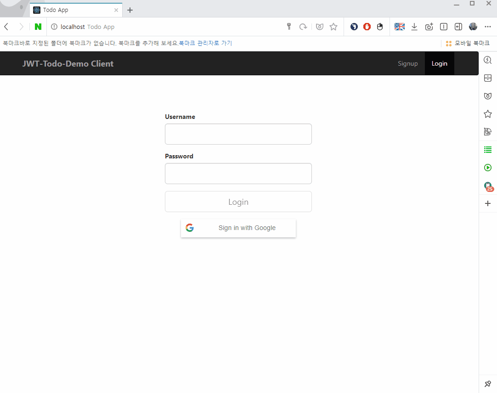
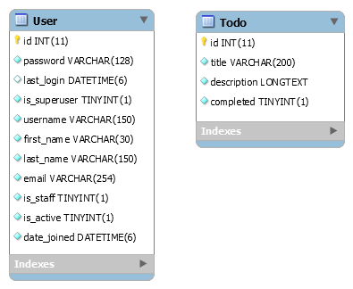
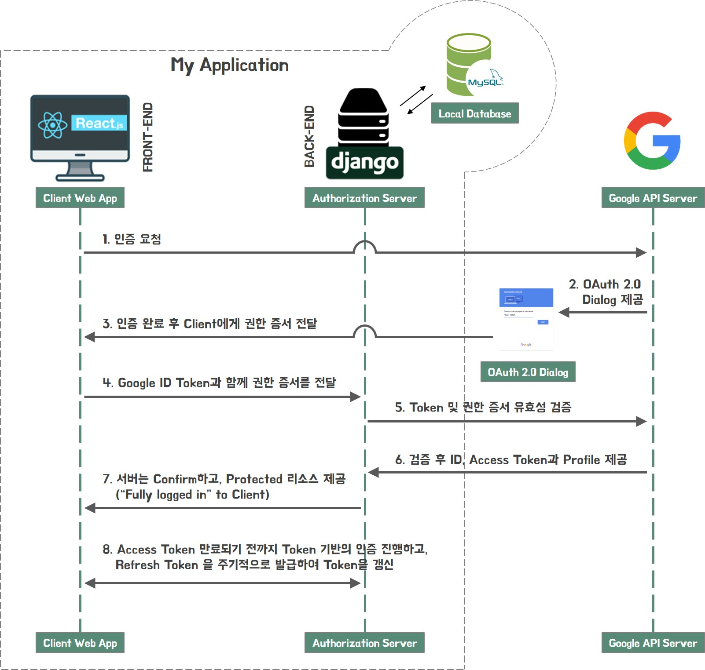
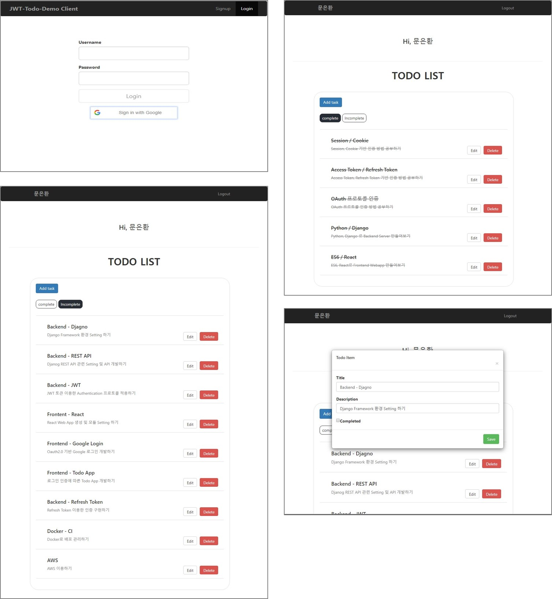

# django-react-todo-manager

#### JWT 기반의 Django Auth REST API, Google Oauth2.0 로그인 가능한 React Client Web App

<kbd>
  
</kbd>

<br>

<br/>

## *Introduction*

### Summary

> - Project 소개
>   - Todos Web Application
>   - Google Social Login 기능 구현
>   - Web App을 통하여 회원 가입 가능하고, Google 계정으로 로그인하면 서버에 자동으로 회원 가입
>   - JWT를 이용한 OAuth 2.0 Auth 프로토콜 기반의 인증 서버 구현
>   - 토큰이 유효하다면 웹 브라우저를 통해 Todo CRUD 서비스 가능
>   - 서버는 RESTful하게 설계되었기 때문에 HTTP 의 ruequst 이용한 CRUD 서비스도 가능
>   - 10분이 지나면 자동으로 토큰 만료되고 로그아웃 처리
>  <br/>
> 
> - BACKEND (Djagno Authentication Server)
>   - Django를 이용하여 회원(User), 일과(Todo) 정보 저장용 REST API 구현
>   - JWT를 이용한 OAuth 2.0 Auth 프로토콜 기반으로 Authentication 및 Authorization 구현 
>  <br/>
> 
> - FRONTEND (React Webapp Client)
>   - React를 이용하여 로그인 및 Todo CRUD 서비스용 Web App 구현
>   - OAuth 2.0 Google API 이용하여 구글 계정으로 소셜 로그인 구현
>   - React Web App을 통하여 회원 가입 가능하고, Google 계정으로 로그인하면 서버에 자동 회원 가입


### Requirements

> - BACKEND (Djagno Authentication Server)
>   - [Python 3.6](https://www.python.org/downloads/release/python-360/)
>   - [Django 2.2.3](https://docs.djangoproject.com/en/2.2/releases/2.2.3/)
>   - [Django REST Framework 3.10.1](https://www.django-rest-framework.org/)
>   - [Django REST Framework JWT 1.11.0](https://github.com/jpadilla/django-rest-framework-jwt)
>  <br/>
> 
> - FRONTEND (React Webapp Client)
>   - [React 16.5.2](https://www.npmjs.com/package/react?activeTab=versions)
>   - [React DOM 16.5.2](https://www.npmjs.com/package/react-dom)
>   - [React Google Login 5.0.4](https://www.npmjs.com/package/react-google-login)
>   - [React Bootstrap 0.32.4](https://www.npmjs.com/package/react-bootstrap)
>  <br/>
> 
> - Database
>   - [MySQL 5.6](https://dev.mysql.com/downloads/mysql/5.6.html)

### Backend End-points

> **Resource modeling**
> 
> - 인증(Token 발급 및 갱신) 관련 API
> 
>   |  HTTP |  Path |  Method |  Permission |  목적 |
>   | --- | --- | --- | --- | --- |
>   |**POST** |/login|CREATE| None |Google의 ID 토큰을 받아 JWT를 반환|
>   |**GET** |/validate|READ| Access Token |JWT를 받아 토큰을 검증하여 상태코드로 반환|
>   |**POST** |/refresh|CREATE| Access Token |JWT를 받아 토큰을 검증하여 새로운 토큰 반환|
> 
> - 회원(User) 리소스 관련 API
> 
>   |  HTTP |  Path |  Method |  Permission |  목적 |
>   | --- | --- | --- | --- | --- |
>   |**GET** |/user|LIST| Access Token |모든 User 조회|
>   |**POST** |/user|CREATE| Access Token |하나의 User 생성|
>   |**GET** |/user/current|READ| Access Token |현재 접속중인 User 조회|
> 
> - 일과(Todo) 리소스 관련 API
> 
>   |  HTTP |  Path |  Method |  Permission |  목적 |
>   | --- | --- | --- | --- | --- |
>   |**GET** |/todo|LIST| Access Token |모든 Todo 조회|
>   |**POST** |/todo|CREATE| Access Token |하나의 Todo 생성|
>   |**GET** |/todo/todo_id|READ| Access Token |하나의 Todo 조회|
>   |**PUT** |/todo/todo_id|UPDATE| Access Token |하나의 Todo 수정|
>   |**DELETE** |/todo/todo_id|DELETE| Access Token |하나의 Todo 삭제|
> 
> **Urls**
> 
> - `backend/api/urls.py`
> ```python
> from django.contrib import admin
> from django.urls import path, include
> from rest_framework_jwt.views import obtain_jwt_token, verify_jwt_token, refresh_jwt_token
> from .views import validate_jwt_token
> 
> urlpatterns = [
> 
>     path('validate/', validate_jwt_token),
>     path('login/', obtain_jwt_token),
>     
>     path('verify/', verify_jwt_token),
>     path('refresh/', refresh_jwt_token),
>     
>     path('user/', include('user.urls')),
>     path('todo/', include('todo.urls'))
> 
> ]
> ```
> 
> - `backend/user/urls.py`
> ```python
> from django.urls import path
> from .views import current_user, UserList
> 
> urlpatterns = [
>     path('', UserList.as_view()),
>     path('current', current_user),
> ]
> ```
> 
> - `backend/todo/urls.py`
> ```python
> from django.urls import path
> from . import views
> 
> urlpatterns = [
>     path('', views.ListTodo.as_view()),
>     path('<int:pk>/', views.DetailTodo.as_view()),
> ]
> ```

### Frontend Components

> **Component description**
> 
> - 로그인/회원가입 관련 Components
> 
>   | File Name |  Directory | 목적 |
>   | --- | --- | --- |
>   | LoginForm.js | /components/auth/ |로그인 Form (기존 회원 or 구글 계정)|
>   | SignupForm.js | /components/auth/ |회원가입 Form|
>   | GoogleLoginButton.js | /components/auth/ |Custom Google Login Button 컴포넌트|
> 
> - 라우팅 관련 Components
> 
>   | File Name |  Directory | 목적 |
>   | --- | --- | --- |
>   | AppliedRoute.js | /components/routing/ |토큰 인증 필요 없는 컴포넌트 라우팅|
>   | AthenticatedRoute.js | /components/routing/ |토큰 인증 필요로 하는 컴포넌트 라우팅|
>   | Nav.js | /components/routing/ |메뉴 네비게이션 라우팅|
> 
> - Todo 관련 Components
> 
>   | File Name |  Directory | 목적 |
>   | --- | --- | --- |
>   | TodoList.js | /components/todo/ |서버로 인증 후 받아온 Todo의 CRUD를 수행|
>   | TodoModal.js | /components/todo/ |Todo Create/Update 하기 위한 모달 윈도 컴포넌트|
> 
> - State 및 핸들러 관련 Components
> 
>   | File Name |  Directory | 목적 |
>   | --- | --- | --- |
>   | Login.js | /containers/ |LoginForm에 대한 로직 수행하는 컴포넌트|
>   | Signup.js | /containers/ |SignupForm에 대한 로직 수행하는 컴포넌트|
>   | Home.js | /containers/ |토큰이 유효성에 따라 결과를 렌더링 시켜주는 컴포넌트|
> 

### Authentication and Authorization

> **JWT configuration**
> 
> - JWT 발급 및 검증 과정과 갱신 관련한 기능은 Django-REST-Framework-JWT를 사용하여 구현
> - `backend/api/settings.py`
> 
> ```python
> REST_FRAMEWORK = {
>     'DEFAULT_PERMISSION_CLASSES': (
>         'rest_framework.permissions.IsAuthenticated',
>     ),
>     'DEFAULT_AUTHENTICATION_CLASSES': (
>         'rest_framework_jwt.authentication.JSONWebTokenAuthentication',
>     ),
> }
> ```
> - Django 서버에서로그인 여부를 확인하는 클래스(DEFAULT_PERMISSION_CLASSES)를 rest_framework.permissions.IsAuthenticated로 사용하도록 설정
> - 로그인과 관련된 클래스(DEFAULT_AUTHENTICATION_CLASSES)를 JWT(rest_framework_jwt.authentication.JSONWebTokenAuthentication)을 사용하도록 설정
> - `backend/api/settings.py`
> 
> ```python
> JWT_AUTH = {
>    'JWT_SECRET_KEY': SECRET_KEY,
>    'JWT_ALGORITHM': 'HS256',
>    'JWT_VERIFY_EXPIRATION' : True,
>    'JWT_ALLOW_REFRESH': True,
>    'JWT_EXPIRATION_DELTA': datetime.timedelta(minutes=10),
>    'JWT_REFRESH_EXPIRATION_DELTA': datetime.timedelta(hours=1),
>    'JWT_RESPONSE_PAYLOAD_HANDLER': 'api.custom_responses.my_jwt_response_handler'
> }
> ```
> - `JWT_SECRET_KEY` : JWT_SECRET_KEY는 Django 프로젝트의 SECRET_KEY로 사용
> - `JWT_ALGORITHM` : 암호화 함수는 HS256으로 설정
> - `JWT_VERIFY_EXPIRATION` : JWT 검증시, 만료 기간 확인
> - `JWT_ALLOW_REFRESH` : JWT 갱신 허용
> - `JWT_EXPIRATION_DELTA` : Access Token의 만료 시간은 10분으로 설정. 10분 지나면 토큰 만료되고, 리소스 접근시 자동 로그아웃
> - `JWT_REFRESH_EXPIRATION_DELTA` : Refresh Token의 만료 시간은 1시간으로 설정. Access Token이 만료되기 전에 계속해서 갱신 가능하지만 1시간 지나면 더이상 갱신 불가
> - `JWT_RESPONSE_PAYLOAD_HANDLER` : JWT Paylod 핸들링 할때 미들웨어 커스텀 핸들러 my_jwt_response_handler 거치도록 설정


### DataBase Models
> 
> **Database schema**
> 
> 

### System configuration
> 
> **Service flow**
> 
> 
> 
> 1. 사용자는 Google API Server에 로그인을 요청
> 
> 2. Google API Server는 사용자에게 특정 쿼리들을 붙인 Google 로그인 Dialog를 트리거
> 
> 3. Google 로그인 인증이 완료되면, access_token, id_token과 함께 권한 증서를 전달
> 
> 4. id_token과 함께 권한 증서를 Authorization Server에 전달
> 
> 5. Authorization Server는 Client Web App으로 부터 받은 토큰과 권한 증서의 유효성을 검증
> 
> 6. 검증이 완료되면, 요청한 access_token이 유효하다고 간주
> 
> 7. 서버는 요청한 리소스와 함께 access_token을 다시 전송 (로그인 인증 과정 완료)
> 
> 8. 로그인 인증이 완료되면 Protected 리소스에 접근 가능하고, Refresh Token 주기적으로 발급하며 Token을 갱신
> 

<br/>


## *Installation*

### Clone project
> 
> - Github repository를 clone
> ```bash
> $ git clone https://github.com/meh9184/django-react-todo-manager.git
> ```
> 

### Configure google api configure
> 
> - `frontend/public/index.html` 파일의
> - header meta 태그에 google-signin-client_id 설정
> - 개인 구글 계정에서 발급받은 Client ID로 입력
> 
> ```html
> 
> <!DOCTYPE html>
> <html lang="en">
>   <head>
>     <meta charset="utf-8">
>     <link rel="shortcut icon" href="%PUBLIC_URL%/favicon.ico">
>     
>     <!-- content에 입력-->
>     <meta name="google-signin-client_id" content="여기에 입력">
> 
>     <meta name="viewport" content="width=device-width, initial-scale=1, shrink-to-fit=no">
>     <meta name="theme-color" content="#000000">
>     <link rel="stylesheet" href="https://maxcdn.bootstrapcdn.com/bootstrap/3.3.7/css/bootstrap.min.css" integrity="sha384-BVYiiSIFeK1dGmJRAkycuHAHRg32OmUcww7on3RYdg4Va+PmSTsz/K68vbdEjh4u" crossorigin="anonymous">
>     <link rel="manifest" href="%PUBLIC_URL%/manifest.json">
>     
>     <title>Todo App</title>
>     <script src="https://apis.google.com/js/platform.js?onload=triggerGoogleLoaded" async defer></script>
>     <script type="text/javascript">
> ```

### Configure db connection
> 
> - `backend/api/settings.py` 파일의
> - DATABASES 부분 USER, PASSWORD 입력
> 
> ```python
> # Database
> 
> DATABASES = {
>     'default': {
>         'ENGINE': 'django.db.backends.mysql',
>         'NAME': 'jwt_todo_demo',
>         'USER': 'INSERT HERE',        # 여기에 입력
>         'PASSWORD': 'INSERT HERE',    # 여기에 입력
>         'HOST': '127.0.0.1',
>         'PORT': '3306'
>     }
> }
> ```

### Create mysql schema 
> 
> - MySQL CLI 상에서 `jwt_todo_demo` 이름으로 스키마 생성
> ```bash
> mysql> create schema jwt_todo_demo;
> ```

### Backend installation

> - backend 디렉터리 `/backend`로 이동
> ```bash
> $ cd backend
> ```
>
> - virtaulenv 설치 안됐다면 apt-get으로 설치하고,
> - virtaulenv 명령어로 현재 디렉터리에 가상환경 `venv` 생성 및 활성화
> - Python 버전은 3.6
> ```bash
> $ sudo apt-get install virtualenv
> $ virtualenv --python=python3.6 venv
> $ source venv/bin/activate
> ```
>
> - libmysqlclient 설치 안됐다면 설치하고,
> - 현재 가상 환경에 requirements.txt의 dependencies 설치
> ```bash
> $ sudo apt-get install libmysqlclient-dev
> $ pip install -r requirements.txt
> ```
>
> - Todo 모델은 app 기반의 custom 모델이기 때문에 makemigrations를 통해 DB 생성하고,
> - migrate 명령어를 통해 MySQL에 테이블 생성
> ```bash
> $ python manage.py makemigrations
> $ python manage.py migrate
> ```
>
> - migrate 작업 완료됐으면 서버 실행
> ```bash
> $ python manage.py runserver
> ```

### Frontend Installation

> - 새로운 쉘 생성하여 frontend 디렉터리 `/frontend`로 이동
> ```bash
> $ cd frontend
> ```
>
> - yarn 설치 안됐다면 apt-get으로 설치하고,
> - yarn install 명령어로 노드 모듈 셋업
> ```bash
> $ sudo apt-get install yarn
> $ yarn install
> ```
>
> - install 완료 됐으면 react-app 실행
> ```bash
> $ yarn start
> ```

<br/>

## *Usage*


### Generate data

> - 위의 Step대로 진행하여 서버 setting 및 run까지 완료했다면, 현재 DB는 비어있는 상태
> - 로그인 및 Todo 요청을 테스트 해보기 위해 임의의 데이터 생성
> - 새로운 쉘을 생성하여 `/backend/venv` 가상환경 활성화
> ```bash
> $ cd backend
> $ source venv/bin/activate
> ```
>
> - loaddata 명령어로 `initial_todos.json` 파일의 Todo 데이터 생성
> ```bash
> $ python manage.py loaddata initial_todos.json
> ```
> 
> - 초기 로그인을 위해 superuser 생성
> ```bash
> $ python manage.py createsuperuser
> ```
> 
> - 웹 브라우저로 접속하여 superuser로 로그인하고, 데이터가 잘 추가 되었는지 확인
>   - [http://localhost:3000/](http://localhost:3000/)
> 
> - React app 상단의 Signup 컴포넌트를 통해 User Signup 동작 수행하는지 테스트
> - superuser 로그인 후 Test Todo data 잘 생성되었는지 확인 / 로그아웃
> - Google 로그인 잘 되는지 확인
> - Todo CRUE 잘 수행되는지 확인
> 
> <div>
>  
> </div>
> 

<br/>

## *Addition Commentary*
> 
### Issues
> 
> - API (POST /login) 을 준수하려고 하다 보니, 이미 Google 계정이 DB에 Create 된 상태에서 POST /login 요청으로 로그인 할 경우 리소스 충돌이 발생하여 400 (Bad Request /login) error 발생
> 
> - 해당 문제는 try catch error 핸들러를 통해 우회하여 서비스에는 지장 없음
> 
> - 그러나, 원활한 통신을 위해 Non Authorized 유저 검색 API를 만들어 Bad Request Error 자체를 없애는 작업 필요
> 

### Tools for Windows OS Users
> - [WSL (Windows Subsystem for Linux)](https://docs.microsoft.com/ko-kr/windows/wsl/install-win10)
> - [VSCode](https://code.visualstudio.com/docs/?dv=win)
> - [Mysql Workbench](https://www.mysql.com/products/workbench/)
> - [Postman](https://www.getpostman.com/downloads/)
> - [Github](https://github.com/meh9184/tmdb-rails)
> 

<br/>

## *References*
> 
> - https://docs.djangoproject.com/ko/2.2/
> - https://velog.io/@odini/series/React-%EA%B3%B5%EC%8B%9D%EB%AC%B8%EC%84%9C
> - https://docs.microsoft.com/ko-kr/windows/wsl/install-win10
> - https://gorails.com/setup/windows/10
> - https://developers.google.com/identity/sign-in/web/
> - https://tools.ietf.org/html/rfc6749
